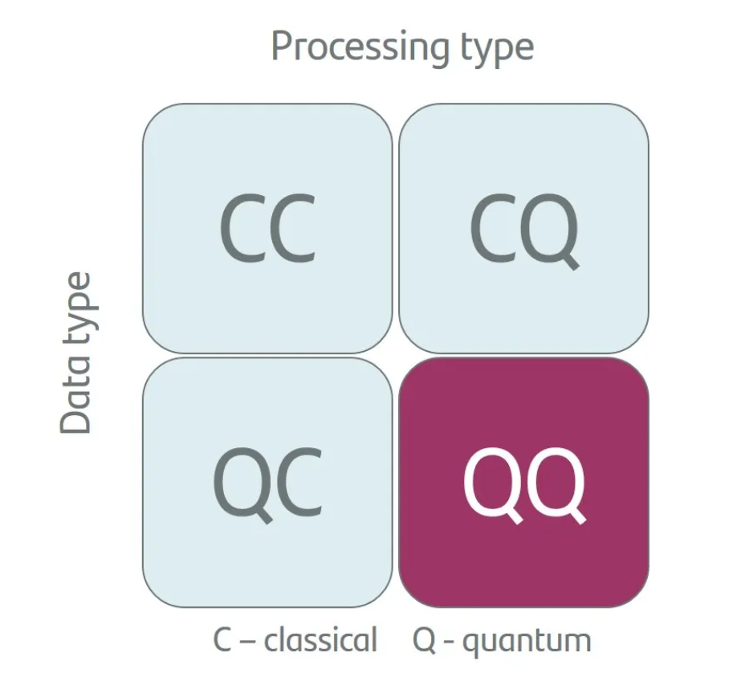

# Quantum Machine Learning 

This repository introduces Quantum Machine Learning (QML), with a focus on solving regression problems using a Quantum Neural Network (QNN) with Qiskit.

Overview:
QNN for Regression: Learn how to integrate quantum circuits to model a regression task using parameterized quantum circuits.
Focus: We work with classical data and quantum processing (CQ) to illustrate the power of quantum circuits in machine learning.
Getting Started:
### Install dependencies:
pip install qiskit

Run the notebook for the QNN regression example.

Quantum Machine Learning Types:

In Quantum Machine Learning (QML), there are four main types based on the data and processing involved:

CC (Classical Data, Classical Processing): Standard machine learning.
CQ (Classical Data, Quantum Processing): Classical data processed with quantum algorithms.
QC (Quantum Data, Classical Processing): Quantum data processed with classical algorithms.
QQ (Quantum Data, Quantum Processing): Quantum data processed by quantum algorithms.
In this tutorial, we focus on CQ because we process classical data using quantum circuits, allowing us to leverage quantum computing's advantages for machine learning tasks like regression.

